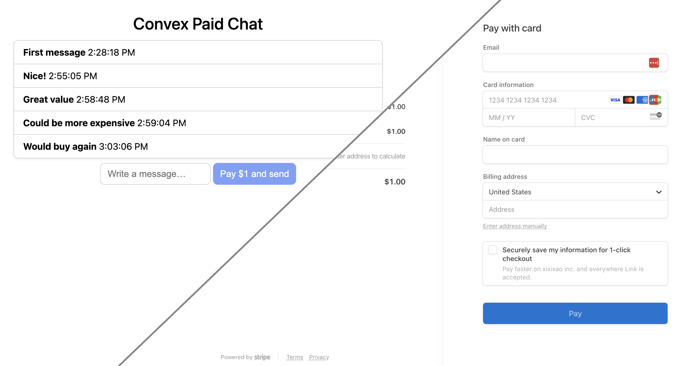

# Convex Stripe Demo

This example app demonstrates how to integrate Stripe, the payments platform, with Convex, the backend application platform. We keep track of payments in Convex and fulfill orders when they're confirmed by Stripe.



Features:

- You can test the payment flow end to end using Stripe's test card numbers

This integration works! You can see a production deployment at this live site: https://xixixao.github.io/paymorebeseen/.

Read a deep dive into this repo in [Wake up, you need to make money! (ft. Stripe)](https://stack.convex.dev/stripe-with-convex) on Stack.

## Setting up

Run:

```
npm install
npm run dev
```

This will guide you through making a Convex project.

To test the payments flow, follow these steps:

1. Sign up for Stripe for free at https://stripe.com/
2. [Install the stripe CLI](https://stripe.com/docs/stripe-cli)
3. Get your HTTP Actions URL from the Convex dashboard (Settings -> URL & Deploy Key -> Show development credentials).
This should looks something like https://happy-dog-123.convex.site
4. Run

```
stripe listen --forward-to <insert your HTTP Actions URL>/stripe
```

5. Copy the "Your webhook signing secret" from the output of the `listen` command, and set it as `STRIPE_WEBHOOKS_SECRET` environment variable on your Convex dashboard
6. Copy your test secret API key from the code example on https://stripe.com/docs/checkout/quickstart and set it as `STRIPE_KEY` environment variable on your Convex dashboard

You can then use the test credit card details to go through the payment flow, see https://stripe.com/docs/checkout/quickstart#testing

# What is Convex?

[Convex](https://convex.dev) is a hosted backend platform with a
built-in database that lets you write your
[database schema](https://docs.convex.dev/database/schemas) and
[server functions](https://docs.convex.dev/functions) in
[TypeScript](https://docs.convex.dev/typescript). Server-side database
[queries](https://docs.convex.dev/functions/query-functions) automatically
[cache](https://docs.convex.dev/functions/query-functions#caching--reactivity) and
[subscribe](https://docs.convex.dev/client/react#reactivity) to data, powering a
[realtime `useQuery` hook](https://docs.convex.dev/client/react#fetching-data) in our
[React client](https://docs.convex.dev/client/react). There are also
[Python](https://docs.convex.dev/client/python),
[Rust](https://docs.convex.dev/client/rust),
[ReactNative](https://docs.convex.dev/client/react-native), and
[Node](https://docs.convex.dev/client/javascript) clients, as well as a straightforward
[HTTP API](https://github.com/get-convex/convex-js/blob/main/src/browser/http_client.ts#L40).

The database support
[NoSQL-style documents](https://docs.convex.dev/database/document-storage) with
[relationships](https://docs.convex.dev/database/document-ids) and
[custom indexes](https://docs.convex.dev/database/indexes/)
(including on fields in nested objects).

The
[`query`](https://docs.convex.dev/functions/query-functions) and
[`mutation`](https://docs.convex.dev/functions/mutation-functions) server functions have transactional,
low latency access to the database and leverage our
[`v8` runtime](https://docs.convex.dev/functions/runtimes) with
[determinism guardrails](https://docs.convex.dev/functions/runtimes#using-randomness-and-time-in-queries-and-mutations)
to provide the strongest ACID guarantees on the market:
immediate consistency,
serializable isolation, and
automatic conflict resolution via
[optimistic multi-version concurrency control](https://docs.convex.dev/database/advanced/occ) (OCC / MVCC).

The [`action` server functions](https://docs.convex.dev/functions/actions) have
access to external APIs and enable other side-effects and non-determinism in
either our
[optimized `v8` runtime](https://docs.convex.dev/functions/runtimes) or a more
[flexible `node` runtime](https://docs.convex.dev/functions/runtimes#nodejs-runtime).

Functions can run in the background via
[scheduling](https://docs.convex.dev/scheduling/scheduled-functions) and
[cron jobs](https://docs.convex.dev/scheduling/cron-jobs).

Development is cloud-first, with
[hot reloads for server function](https://docs.convex.dev/cli#run-the-convex-dev-server) editing via the
[CLI](https://docs.convex.dev/cli). There is a
[dashbord UI](https://docs.convex.dev/dashboard) to
[browse and edit data](https://docs.convex.dev/dashboard/deployments/data),
[edit environment variables](https://docs.convex.dev/production/environment-variables),
[view logs](https://docs.convex.dev/dashboard/deployments/logs),
[run server functions](https://docs.convex.dev/dashboard/deployments/functions), and more.

There are built-in features for
[reactive pagination](https://docs.convex.dev/database/pagination),
[file storage](https://docs.convex.dev/file-storage),
[reactive search](https://docs.convex.dev/text-search),
[https endpoints](https://docs.convex.dev/functions/http-actions) (for webhooks),
[streaming import/export](https://docs.convex.dev/database/import-export/), and
[runtime data validation](https://docs.convex.dev/database/schemas#validators) for
[function arguments](https://docs.convex.dev/functions/args-validation) and
[database data](https://docs.convex.dev/database/schemas#schema-validation).

Everything scales automatically, and it’s [free to start](https://www.convex.dev/plans).
